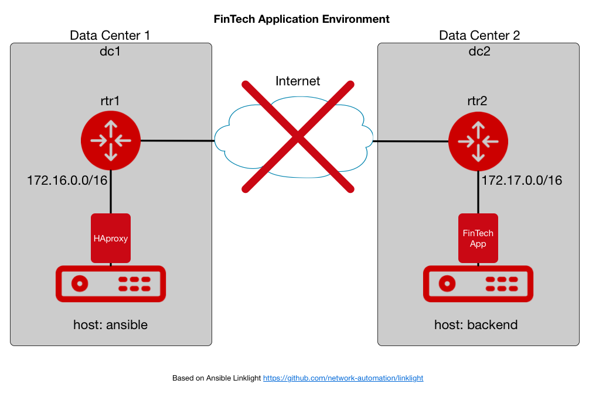
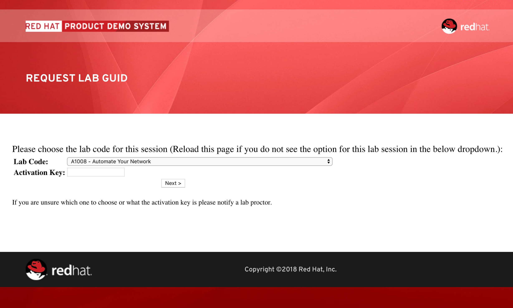
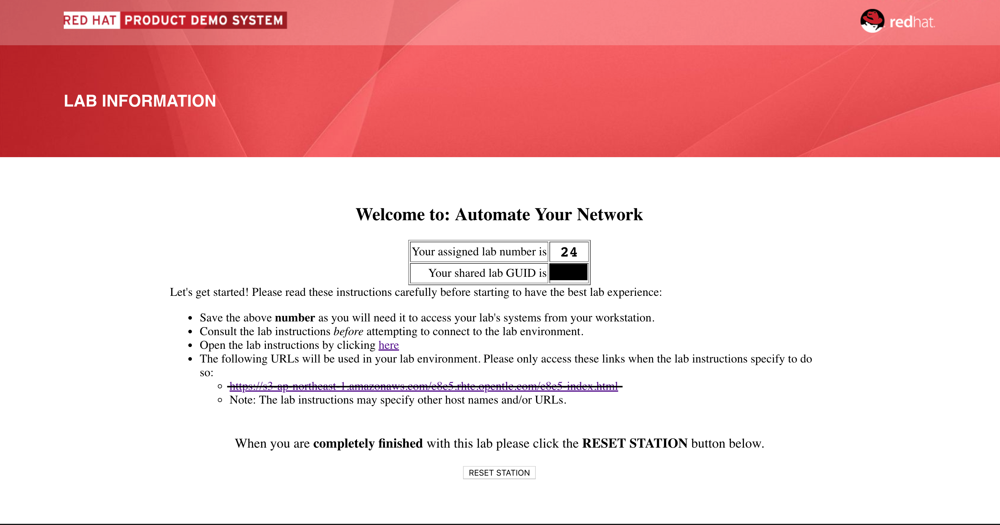
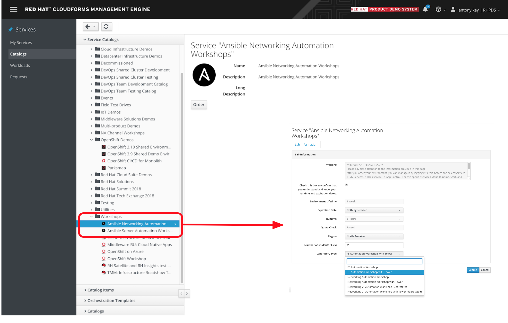
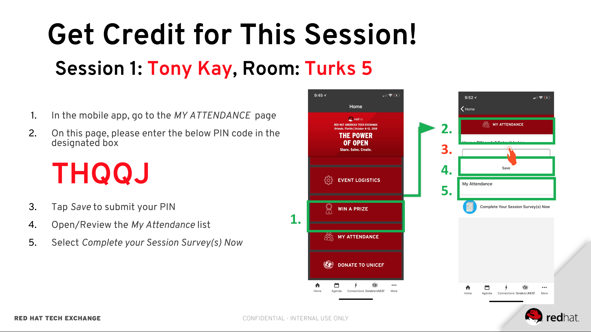
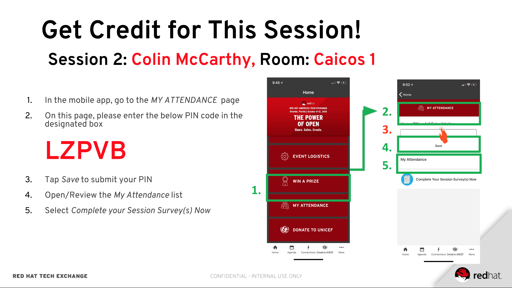
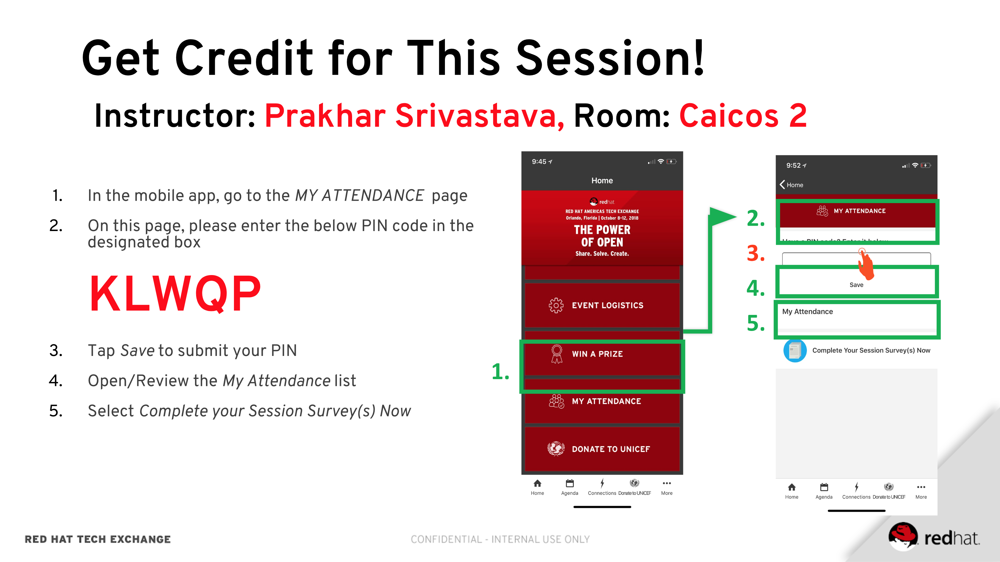

== &nbsp;
:noaudio:
ifdef::revealjs_slideshow[]
[#cover,data-background-image="image/1156524-bg_redhat.png" data-background-color="#cc0000"]

[#cover-h1]
Red Hat Ansible Networking

[#cover-h2]
Ansible Networking

[#cover-logo]
image::{revealjs_cover_image}[]

endif::[]

:scrollbar:
:data-uri:
:noaudio:

== Ansible RHTE Networking lab Overview

* The RHTE Lab
* Ansible Networking Overview in 5 slides
* *Lab Time*
* Review
* Next Steps

ifdef::showscript[]
=== Transcript

Hello and Welcome, I'm _name_ and I'm happy you are joining us for the Ansible
Network Automation Lab.

We want to give you us much hands on time today as possible so we've embedded
most of the training content inline in the lab itself.

But before we start the labs a quick overview of the Lab environment itself, which has
been pre-provisioned for you.

Ansible is gaining significant traction in the networking space because of
its excellent support for network devices and vendors, ease of use and
learning, and also because its agentless architecture makes it superior to its
competitors for use in a networking environment

So we will be taking a whistle stop tour of some of the key Ansible Networking
capabilities you'll be using today before we start.

But first some questions:

- How many of you would have a reasonable exposure to Ansible?
- How many of you would consider yourself "networking people"? "Server people"?
- How many of you are new to Ansible? *Welcome*

This is a guided lab so everyone should be able to complete and we have some
stretch and bonus labs for any of you who complete it quickly.

Finally a thank you to our facilitators who are here to assist.

<introduce them>

Feel free to ask them, myself, and my co-instructor _instructor name_  any
questions you may have during the session.

endif::showscript[]

:scrollbar:
:data-uri:
:noaudio:

== Lab Scenario

Financial Services company FinTech provides back-end services for their clients in the Financial Services industry. Unfortunately a widespread global attack on Cisco Routers has disrupted their network infrastructure and broken a key customer facing application.

Your role, as a *Red Hat Ansible Networking Consultant*, is to regain control of the network infrastructure, restore network services, and protect against further attacks. FinTech have provided Red Hat with an outline of key steps for this engagement.

* Access the current state of the Networking Infrastructure
** Explore the existing level of connectivity and router configuration
* Preserve for InfoSec as forensics the current configurations of the routers
** Backup both routers current configurations
* Re-establish connectivity between the 2 FinTech Data Centers
** Setup a networking tunnel between the 2 sites (GRE)
** Restore routing between the 2 sites
* Test the application now works as expected
** Can the application front-end now access the remote data center hosting the
application?

ifdef::showscript[]
Transcript:

This lab draws heavily on the Ansible Linklight Networking Lab with a fun
security twist to it and some extra steps.

Each of you will have your own environment which you will explore and then
gradually re-configure until you have gained complete control of the
environment. So lets take a look...

endif::showscript[]

:scrollbar:
:data-uri:
:noaudio:

== Lab Environment

ifdef::showscript[]
Transcript:

FinTech's topology is quite simple with 2 Data Centers: DC1 and DC2 which lack
their own dedicated private inter-connection. Traffic between the 2 sites is
routed across the Internet in a networking *Tunnel* created between 2 Cisco
routers, one on each site.

This GRE (Generic Routing Encapsulation) Tunnel between the 2 sites allows traffic to be simply routed back and forward between
the 2 data Centers as if they had a dedicated connection between the 2 sites.  FinTech's key application is split across the 2 sites and relies on this
connection

These routers have been hacked in a recent global attack aimed at publicly
exposed Cisco routers. Since then site-to-site communication has been broken
though insecure public Internet access exists to all externally exposed
machines.

Your job will be to regain control and re-configure the Network.

So a quick fly over of key Ansible features, plugins, and modules we will be
using today - in 5 slides.

endif::showscript[]

:scrollbar:
:data-uri:
:noaudio:

== Network Device Connectivity

image::./images/network-device-module-execution.png[width=100%]

* *Most* network devices lack the ability to execute Python locally
* Linux Windows and other “server type” platforms execute the module code on
  _target_ device
* Network devices typically execute the module *on the control* node
** Commands and configuration are then sent to the device via a CLI session or an API

ifdef::showscript[]
Transcript:

First one fundamental difference between how Ansible works in a server
environment and in a networking environment id where the modules actually
execute.

Servers have the capability of executing code locally via Python so typical
Ansible behavior is to connect via ssh, or WinRM for Windows platforms, and copy
the modules over for *local* execution.

Network devices don't always have this capability so the modules are executed
on the _Control Node_ and then each task is performed via cli or API calls to
the network device. Recent additions to Ansible though have made this largely
transparent to the operator.

endif::showscript[]

:scrollbar:
:data-uri:
:noaudio:

== `network_cli` and NETCONF

* Ansible 2.5 introduced 2 new Connection Types
* Network Modules now _appear to behave_ much more like Server Modules
** NETCONF
** network_cli

* `network_cli` connection syntax
+
[source,yaml]
----
- name: backup router configurations
  hosts: cisco
  connection: network_cli
  gather_facts: no

  tasks:
  - name: backup router configurations
    ios_config:
      backup: yes
----
+
[source,yaml]
----
ansible routers -m ping -c network_cli
----

ifdef::showscript[]
Transcript:

Enhancements in Ansible 2.5 introduced 2 new connection plugins `network_cli`
and `NETCONF`. They make network connectivity more streamlined and playbooks
have a similar look and feel to Server playbooks.

Under the covers both use `ssh` as their transport

Today we will be using `network_cli` though as NETCONF matures and gains wider
adoption expect to see it more in the future.
endif::showscript[]

:scrollbar:
:data-uri:
:noaudio:

== Ansible Device Connectivity: `ansible_network_os`

* Both `network_cli` and `NETCONF` require you to specify the `ansible_network_os`
** Informs Ansible what type of platform network device conforms to
** `ansible_network_os` vendor specific e.g. `eos`, `ios`, `junos` etc
[source,ini]
----
[arista]
eos ansible_host=192.168.2.10 ansible_connection=network_cli ansible_network_os=eos

[juniper]
junos ansible_host=192.168.2.20 ansible_connection=netconf ansible_network_os=junos
----

.Table Title
|===
|Network Platform|`ansible_network_os`

|Arista EOS
|eos

|Cisco IOS
|ios

|Cisco IOS-XR
|iosxr

|Cisco NX-OS
|nxos

|Juniper Junos
|junos

|VyOS
|vyos
|===

ifdef::showscript[]
Transcript:

Both `NETCONF` and `network_cli` need information about the devices they are
connecting to and this is supplied by the inventory variable
`ansible_network_os`.

In todays lab you will be setting this to `ios` and using `network_cli` to
connect to the Cisco routers. However Ansible provides support for the
major network operating systems for example Arista's EOS, Juniper's junos etc..

endif::showscript[]

:scrollbar:
:data-uri:
:noaudio:

== Ansible Networking Modules

- Ansible has extensive support with hundreds of modules for Networking
- Broad support for a wide variety of vendors and devices

However *3 Core groups of Modules* provide *extensive* capability

* `*_facts` e.g. `ios_facts`, `eos_facts`, `junos_facts` etc
** Perform same fact gathering function as `setup` module for servers

* `*_command` e.g. `ios_command`, `eos_command`, `junos_command` etc
** Similar to `command` module
** Allows Network Operators to talk to devices using familiar syntax

+
[source,bash]
----
$ ansible cisco -m ios_command -a "commands='sh banner motd'" -c network_cli
----

* `*_config` e.g. `ios_config`, `eos_config`, `junos_config` etc
** Allows Network Operators to configure devices using:
*** Familiar syntax
*** Configuration Files

ifdef::showscript[]
=== Transcript

Whilst Ansible has hundreds of modules available for Networking Devices
increasingly the direction is converging around 3 core groups of modules.

The first group are the `*_facts` modules which can be prefixed by the network
operating system, for example today we will use `ios_facts` to explore the
routers. These modules perform a similar function to the `setup` module which
does not support networking devices. So it is typical to see `gather_facts:` set
to `false` in Networking Playbooks

Next are the `*_command` modules. These allow Network Operators to execute
commands against network devices. What is particularly powerful is once an
operator learns the simple syntax around the module the commands that are sent
are exactly the same as the commands an operator would type on the console of
the device.

Finally the 3rd group of modules are the `*_config` modules for configuring
Network Devices. Again they leverage the same command sets and operators can
include both commands and load configuration or backup files onto the target
devices.

endif::showscript[]

:scrollbar:
:data-uri:
:noaudio:

== LAB TIME

. Begin by going to http://bit.ly/rhte-guidgrabber

. From this page select the *Lab Code* :  _A1008 - Automate Your Network_

. Enter the *Activation Key* provided by the lab instructor.

. Click *Next*.

. The resulting page will display your lab's GUID and other useful information
  about your lab environment.

* You have been provided with your student id `student1, student2 etc`

* Finish the labs!

ifdef::showscript[]
Transcript:

endif::showscript[]

:scrollbar:
:data-uri:
:noaudio:

== GUID Screen 1

ifdef::showscript[]
Transcript:

endif::showscript[]

:scrollbar:
:data-uri:
:noaudio:

== Lab GUID Screen 2

ifdef::showscript[]
Transcript:

endif::showscript[]

:scrollbar:
:data-uri:
:noaudio:

== Next Steps and Resources

* link:https://github.com/network-automation/linklight[Linklight Networking
  Labs]

* link:https://mojo.redhat.com/community/communities-at-red-hat/management/automation-community-of-practice[Ansible
  Community of Practice]
* Good Ansible Networking Blog Articles
** link:https://www.ansible.com/blog/coming-soon-networking-features-in-ansible-2.5[Networking
Features in Ansible 2.5]

** link:https://www.ansible.com/blog/coming-soon-networking-features-in-ansible-2.5[Porting
Ansible Network Playbooks with new Connection Plugins]
* link:https://docs.ansible.com/ansible/latest/network/getting_started/network_differences.html[How
  Network Automation is Different]

:scrollbar:
:data-uri:
:noaudio:

== Ansible Linklight and Networking Labs on demand

* https://github.com/network-automation/linklight
* In https://rhpds.redhat.com now - Labs go live next week
* Available to every SA and Consultant
* Lightbulb Labs:
** Engine 
** Engine and Tower
** Networking Cisco 
** Networking Cisco Tower 
** Networking F5 
** Networking F5 Tower 
* Runs on AWS in multiple regions
* Up to 50 users

ifdef::showscript[]
Transcript:

endif::showscript[]

== Network and Ansible Lightbulb Labs and Demos 

ifdef::showscript[]
Transcript:

endif::showscript[]

:scrollbar:
:data-uri:
:noaudio:

== Register your attendance
:scrollbar:
:data-uri:
:noaudio:

ifdef::showscript[]
=== Transcript

endif::showscript[]
== Register your attendance
:scrollbar:
:data-uri:
:noaudio:

ifdef::showscript[]
=== Transcript

endif::showscript[]
== Register your attendance
:scrollbar:
:data-uri:
:noaudio:

ifdef::showscript[]
=== Transcript

endif::showscript[]
